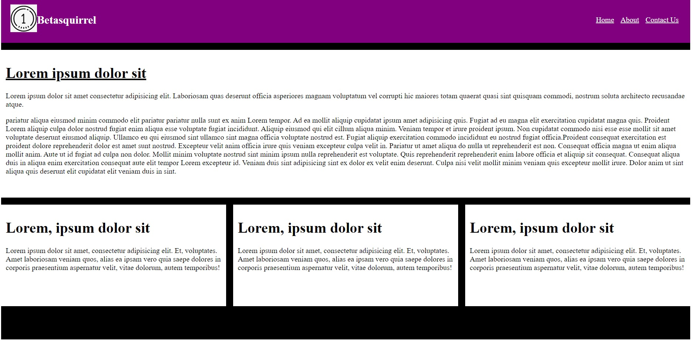
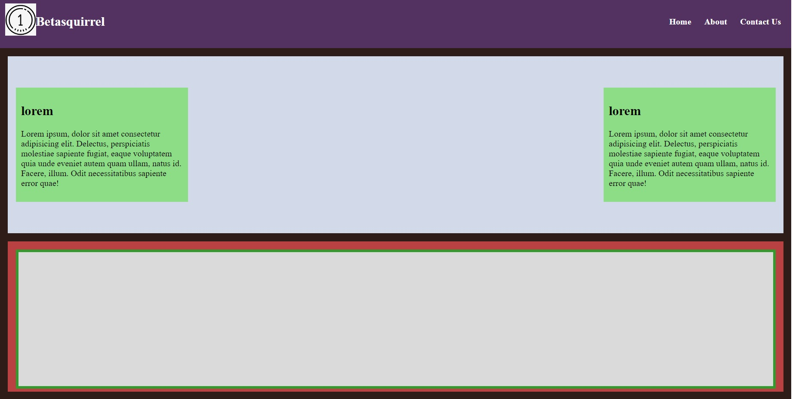
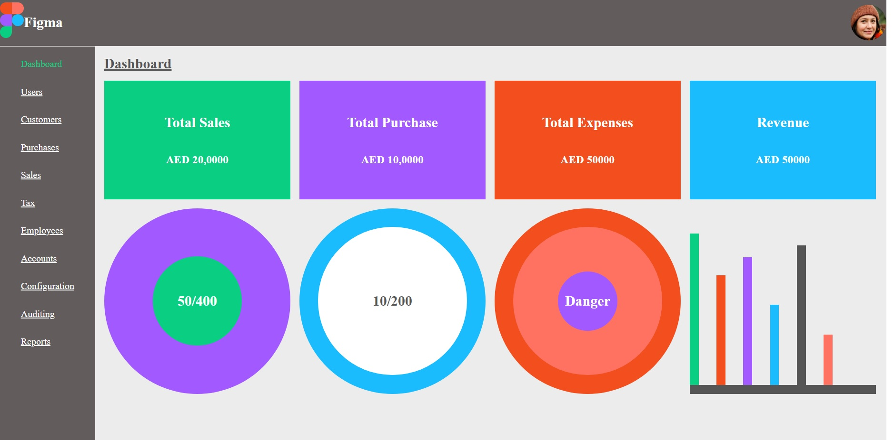

# html-tasks

Assignments from betasquirrel

## Requirements

| requirements                     | Output |
| -------------------------------- | ------ |
|  | Two    |
|  | Two    |
|  | Two    |

### Formatting

Sit excepteur ~~et in minim nostrud~~. Sint **fugiat commodo minim anim adipisicing** consequat id enim _officia ullamco mollit_ amet. Pariatur et nulla ex commodo adipisicing et eiusmod exercitation in ad dolore labore commodo cillum. Esse officia incididunt nulla aute enim aliqua proident proident reprehenderit cupidatat qui.

`git commit`

## Linux Commands

- 'cd' - Change current directory. Ex:'cd Desktop', 'cd ...'
- 'ls' - List contents of a directory Ex: 'ls -a' lists hidden files as well.
- 'pwd' - Display current working directory path.
- 'cat' - Display contents of a file. Ex: 'cat README.md'

## Git Commands

1. 'git config' Configure git user. Ex: 'git config --global user.name "haseenaabdulla"', 'git config --global user.email "haseenahmrs4@gmail.com"'
2. 'git clone' Clone a remote git repo to your local. Ex: 'git clone https://github.com/haseenaabdulla/html-tasks.git' , 'git clone https://github.com/haseenaabdulla/html-tasks.git new-folder'
3. 'git add' Add your file changes to git. Ex: 'git add .' , 'git add README.md'
4. 'git commit' Commit changes to git. Ex: 'git commit -n "Initial commit"'
5. 'git push' Push your local commits to remote repo. Ex: 'git push origin main'

## Task 3

Read the below pages andattend the tests

- [HTML](https://www.w3schools.com/html/default.asp)
- [Elements](https://www.w3schools.com/html/html_elements.asp)
- [Attributes](https://www.w3schools.com/html/html_attributes.asp)
- [Headings](https://www.w3schools.com/html/html_headings.asp)
- [Paragraphs](https://www.w3schools.com/html/html_paragraphs.asp)
- [styles](https://www.w3schools.com/html/html_styles.asp)
- [formatting](https://www.w3schools.com/html/html_formatting.asp)
- [Quotations](https://www.w3schools.com/html/html_quotation_elements.asp)
- [Comments](https://www.w3schools.com/html/html_comments.asp)
- [colors](https://www.w3schools.com/html/html_colors.asp)
- [css](https://www.w3schools.com/html/html_css.asp)
- [Links](https://www.w3schools.com/html/html_links.asp)
- [Images](https://www.w3schools.com/html/html_images.asp)

## Task 5

- [Favicon](https://www.w3schools.com/html/html_favicon.asp)
- [Tables](https://www.w3schools.com/html/html_tables.asp)
